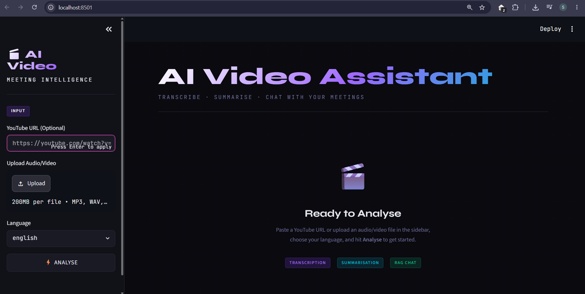
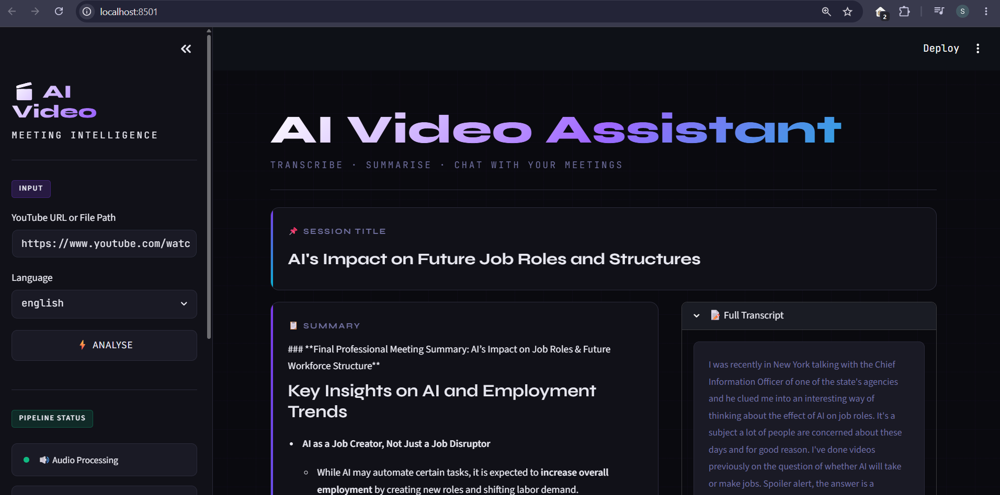
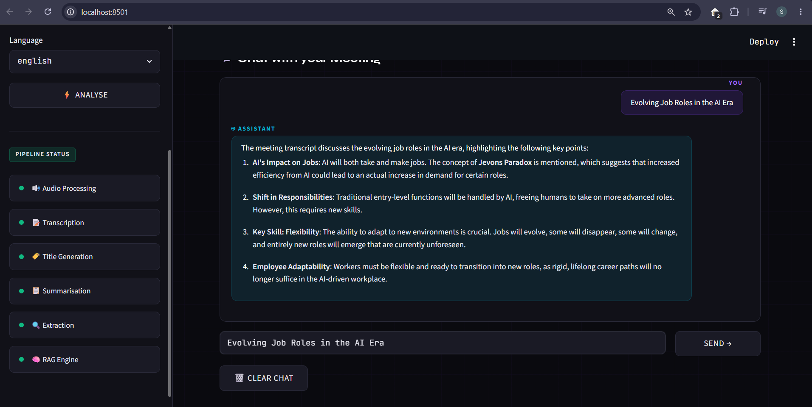

# 🎬 AI Video Assistant


> **An AI-powered Meeting Intelligence Assistant that transcribes YouTube videos or uploaded audio/video files, generates professional meeting summaries, extracts action items, identifies key decisions, and enables semantic question answering using Retrieval-Augmented Generation (RAG).**

---

# 🚀 Project Status

✅ Fully functional and tested locally.

🐳 Docker support has been added for containerized execution.

☁️ Cloud deployment is planned for a future update.

---

# ✨ Features

- 🎥 Analyze YouTube videos
- 📁 Upload local audio/video files
- 🎙️ Automatic Speech-to-Text transcription
- 🌐 English & Hinglish support
- 📝 AI-generated meeting title
- 📋 Professional meeting summary
- ✅ Extract action items
- 🔑 Extract key decisions
- ❓ Identify unanswered questions
- 💬 Chat with meeting transcripts using RAG
- 🧠 ChromaDB Vector Database
- ⚡ Modern Streamlit User Interface
- 🐳 Docker support for containerized execution

---

# 🏗️ Architecture

```text
                YouTube / Local File
                         │
                         ▼
                Audio Processing
                         │
                         ▼
                  Whisper / Sarvam
                  Transcription
                         │
                         ▼
                Mistral AI Processing
                         │
      ┌──────────────────┼──────────────────┐
      ▼                  ▼                  ▼
 Meeting Summary    Action Items     Key Decisions
      │
      ▼
 Generate Embeddings
      │
      ▼
     ChromaDB
      │
      ▼
     RAG Chat Assistant
```

---

# 🛠 Tech Stack

## Frontend

- Streamlit

## AI Models

- OpenAI Whisper
- Mistral AI
- Sarvam AI

## AI Frameworks

- LangChain
- LangChain LCEL

## Vector Database

- ChromaDB

## Embedding Model

- HuggingFace Sentence Transformers

## Audio Processing

- yt-dlp
- FFmpeg
- pydub

## Programming Language

- Python 3.11

---

# 📂 Project Structure

```text
Video-AI-Assistant/
│
├── app.py
├── main.py
├── requirements.txt
├── packages.txt
├── Dockerfile
├── .dockerignore
├── .env.example
├── README.md
│
├── core/
│   ├── extractor.py
│   ├── rag_engine.py
│   ├── summarizer.py
│   ├── transcriber.py
│   └── vector_store.py
│
├── utils/
│   └── audio_processor.py
│
├── assets/
└── vector_db/
```

---

# ⚙️ Running Locally

## 1. Clone the Repository

```bash
git clone https://github.com/SumanSumeet/Video-AI-Assistant.git

cd Video-AI-Assistant
```

---

## 2. Create a Virtual Environment

### Windows

```bash
python -m venv .venv

.venv\Scripts\activate
```

### Linux / macOS

```bash
python3 -m venv .venv

source .venv/bin/activate
```

---

## 3. Install Dependencies

```bash
pip install -r requirements.txt
```

---

## 4. Install FFmpeg

Download FFmpeg from

https://ffmpeg.org/download.html

Add FFmpeg to your system PATH.

Verify installation

```bash
ffmpeg -version
```

---

# 🔑 Environment Variables

Create a `.env` file in the project root.

```env
MISTRAL_API_KEY=your_api_key

SARVAM_API_KEY=your_api_key

WHISPER_MODEL=small
```

---

# ▶️ Run the Application

```bash
streamlit run app.py
```

Open

```
http://localhost:8501
```

---

# 🐳 Running with Docker

This project includes Docker support for running the application inside a container.

## Build the Docker Image

```bash
docker build -t ai-video-assistant .
```

## Run the Docker Container

```bash
docker run -p 7860:7860 ai-video-assistant
```

Open

```
http://localhost:7860
```

---

# 📥 Supported Inputs

### YouTube Video

```
https://www.youtube.com/watch?v=...
```

### Audio Files

```
meeting.mp3
meeting.wav
meeting.m4a
```

### Video Files

```
meeting.mp4
meeting.mov
meeting.avi
```

---

# 💬 Chat with Your Meeting

After analysis, users can ask natural language questions such as:

- What were the key decisions?
- Who is responsible for deployment?
- What tasks were assigned?
- Summarize the meeting.
- What questions remain unanswered?

The assistant answers strictly from the meeting transcript using Retrieval-Augmented Generation (RAG).

---

# 📸 Application Preview

> Screenshots of the application interface will be added soon.

You can place screenshots inside the `assets/` folder and reference them here.

Example:

```markdown





```

---

# ☁️ Future Deployment

The project has already been Dockerized and is ready for future deployment on platforms such as:

- Azure Container Apps
- AWS
- Google Cloud Run
- Render
- Railway

---

# 🔮 Future Improvements

- Speaker Diarization
- PDF Export
- DOCX Export
- Meeting Timeline
- Multi-language Translation
- User Authentication
- Meeting History
- Streaming Transcription
- GPU Inference
- Cloud Deployment Pipeline

---

# 🤝 Contributing

Contributions are welcome!

1. Fork the repository
2. Create a feature branch

```bash
git checkout -b feature-name
```

3. Commit your changes

```bash
git commit -m "Add new feature"
```

4. Push to your branch

```bash
git push origin feature-name
```

5. Open a Pull Request

---

# 👨‍💻 Author

## Suman Sumeet

🔗 **GitHub**

https://github.com/SumanSumeet

🔗 **LinkedIn**

https://www.linkedin.com/in/suman-sumeet-62b903324/

---

# ⭐ Support

If you found this project useful, please consider giving it a ⭐ on GitHub.

Feedback, suggestions, and contributions are always welcome!